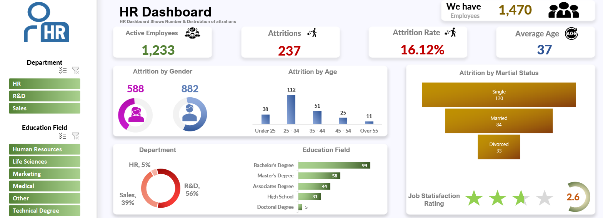

# HR Attrition Dashboard 📊  

## Overview  
This **HR Dashboard**, built using **Microsoft Excel**, provides a clear analysis of **employee attrition**. It visualizes both the **number** and **distribution** of employee attritions, helping HR teams understand key trends and patterns to make informed decisions.  https://github.com/BahaaMedhat1/HR-Report-using-Excel/blob/main/README.md

 
---

## Purpose  
The main aim of this dashboard is to:  
✅ **Show the number of attritions** within the company.  
✅ **Analyze the distribution** of attritions across various categories like:  
   - Gender  
   - Age  
   - Marital Status  
   - Departments  
   - Education Levels  

This helps HR identify the root causes of attrition and develop better employee retention strategies.  

---

## Key Insights  
- **Total Employees**: **1,470**  
- **Active Employees**: **1,233**  
- **Total Attritions**: **237**  
- **Attrition Rate**: **16.12%**  
- **Average Employee Age**: **37**  

### Attrition Breakdown:  
1. **By Gender**  
   - Female Attritions: **588**  
   - Male Attritions: **882**  

2. **By Age Group**  
   - Under 25: **38**  
   - 25-34: **112**  
   - 35-44: **51**  
   - 45-54: **25**  
   - Over 55: **11**  

3. **By Marital Status**  
   - Single: **120**  
   - Married: **84**  
   - Divorced: **33**  

4. **By Department**  
   - HR: **5%**  
   - R&D: **56%**  
   - Sales: **39%**  

5. **By Education Field**  
   - Bachelor's Degree: **99**  
   - Master's Degree: **58**  
   - Associate's Degree: **44**  
   - High School: **31**  
   - Doctoral Degree: **5**  

6. **Job Satisfaction**  
   - Overall Rating: **2.6/5**  

---

## Tools Used  
- **Microsoft Excel**: For creating visuals, aggregating data, and building the interactive dashboard.  

---

## Features  
✅ **Interactive Visuals**: Insights by department, age group, gender, and education level.  
✅ **Clean and Simple Layout**: Easy to understand metrics and charts.  
✅ **Actionable Insights**: Allows HR teams to pinpoint trends for better decision-making.  

---

## Why This Project?  
Employee attrition can significantly impact a company’s performance. This dashboard helps HR managers:  
- Understand **attrition trends**.  
- Identify which departments, age groups, or education levels are most affected.  
- Take proactive measures to **improve job satisfaction** and **reduce attrition rates**.  

---

## How to Use  
1. Open the Excel file containing the HR dashboard.  
2. Use slicers to filter data by **Departments** or **Education Fields**.  
3. Analyze the visualizations to understand attrition patterns.  

---

## About the Author  
**Bahaa Medhat Wanas**  
- [LinkedIn](https://www.linkedin.com/in/bahaa-wanas-9797b923a)  
- **Email**: bahaawanas427@gmail.com  

